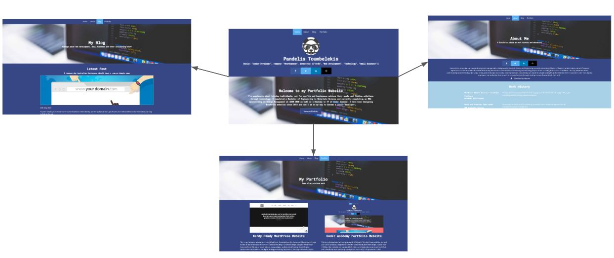

# Pandelis Toumbelekis' Portfolio Website

## Purpose

The purpose of my website is to showcase my various skills and training in web development and engineering as well as other skills I have attained as a freelance web 
developer such as digital marketing and SEO. My goal is to not only show potential employers that I can code but that I am interested and care deeply about 
how to develop and grow businesses through technology.

## Functionality and Features

Some functionality and features included are:
- Links to my professional Github and LinkedIn accounts as well as my freelance business Facebook and Twitter accounts.
- My work and study history with a link to a PDF of my current resumé (About page).
- Skills and interests in web development, digital marketing and business in general.
- A list of blog posts about website design and practical information about small business websites.
- Portfolio of projects including this website and my WordPress website porfolio [Nerdy Pandy](https://nerdypandy.com.au).

## Sitemap

### List of pages:
Home
About
Blog
Porfolio

### Sitemap

## Screenshots

### Wireframes

**Desktop**
[Home Desktop Wireframe](docs/Home_desktop_wireframe.JPG)
[About Desktop Wireframe](docs/About_desktop_wireframe.JPG)
[Blog Desktop Wireframe](docs/Blog_desktop_wireframe.JPG)
[Portfolio Desktop Wireframe](docs/Portfolio_desktop_wireframe.JPG)

**Mobile**
[Home Mobile Wireframe](docs/Home_mobile_wireframe.JPG)
[About Mobile Wireframe](docs/About_mobile_wireframe.JPG)
[Blog Mobile Wireframe](docs/Blog_mobile_wireframe.JPG)
[Portfolio Mobile Wireframe](docs/Portfolio_mobile_wireframe.JPG)

### Screenshots of website

**Desktop**
[Home Desktop](docs/Home_desktop_screenshot.JPG)
[About Desktop](docs/About_desktop_screenshot.JPG)
[Blog Desktop](docs/Blog_desktop_screenshot.JPG)
[Portfolio Desktop](docs/Home_desktop_screenshot.JPG)

**Mobile**
[Home Mobile](docs/Home_mobile_screenshot.JPG)
[About Mobile](docs/About_mobile_screenshot.JPG)
[Blog Mobile](docs/Blog_mobile_screenshot.JPG)
[Portfolio Mobile](docs/Portfolio_mobile_screenshot.JPG)

## Target Audience

My target audience is for people currently looking for freelancers to build their website and create a digital marketing strategy. As I grow my portfolio I would like to 
also expand into more development roles which is why I call myself a 'Junior Developer'. Ultimately this will result in working for a more established technology company.

## Tech Stack
html
css
